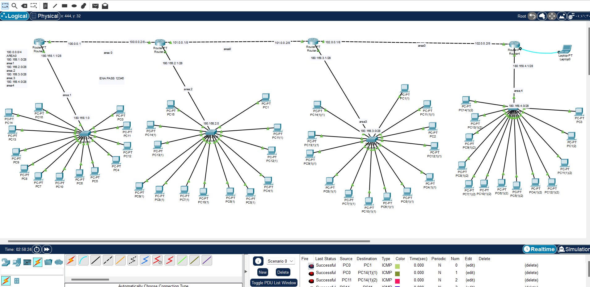

 وصف المشروع: 
 إعداد شبكة OSPF بتصميم Point-to-Point

# OSPF Point-to-Point Network

## Project Description
تم إنشاء شبكة تعتمد بروتوكول OSPF (Open Shortest Path First) لتوزيع المسارات بين أجهزة التوجيه باستخدام هيكلية Point-to-Point.  
الشبكة تحتوي على 7 شبكات فرعية موزعة على 4 مناطق، مع تعيين Area 0 كـ Backbone Area لربط جميع المناطق الأخرى.

## Network Details

| # | Network Description       | Area  | IP/Mask        | Devices |
|---|---------------------------|-------|----------------|---------|
| 1 | Router1 ↔ Router2 Link    | 0     | 100.0.0.0/8    | -       |
| 2 | Router2 ↔ Router3 Link    | 0     | 101.0.0.0/8    | -       |
| 3 | Router3 ↔ Router4 Link    | 0     | 102.0.0.0/8    | -       |
| 4 | Router1 Subnet            | 1     | 180.168.1.1/28 | 14      |
| 5 | Router2 Subnet            | 2     | 180.168.2.1/28 | 14      |
| 6 | Router3 Subnet            | 3     | 180.168.3.1/28 | 14      |
| 7 | Router4 Subnet            | 4     | 180.168.4.1/28 | 14      |

## Notes
- Area 0 هي العمود الفقري (Backbone) للشبكة وتربط جميع المناطق الأخرى.
- تم استخدام Point-to-Point Links بين الراوترات لتسهيل عملية التوجيه وتقليل التعقيد.
- تم اختيار /28 Subnet Mask للشبكات الطرفية ليتوافق مع عدد الأجهزة (14 جهازًا لكل شبكة).
  ملاحظة
  لقد تم ارفق الملف في المستودع
  R1,R2,R3,R3
  enable password:12345
